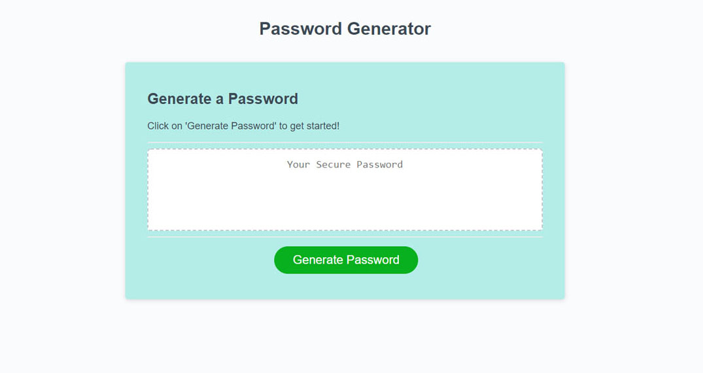

# Password Generator

How it works:

- Click generate password.
- Select password length from 8 - 128.
- Confirm Length.
- Confirm or Cancel the use the use of numberic digits.
- Confirm or Cancel the use of lowercase letter.
- Confirm or Cancel the use of uppercase letter.
- Confirm or Cancel the use of special characters.

A password is then generated.

---

## Demo:

Website: https://jeanhern81.github.io/javascript-password-generator/

---

## Technologies Used:
HTML, CSS, JavaScript

